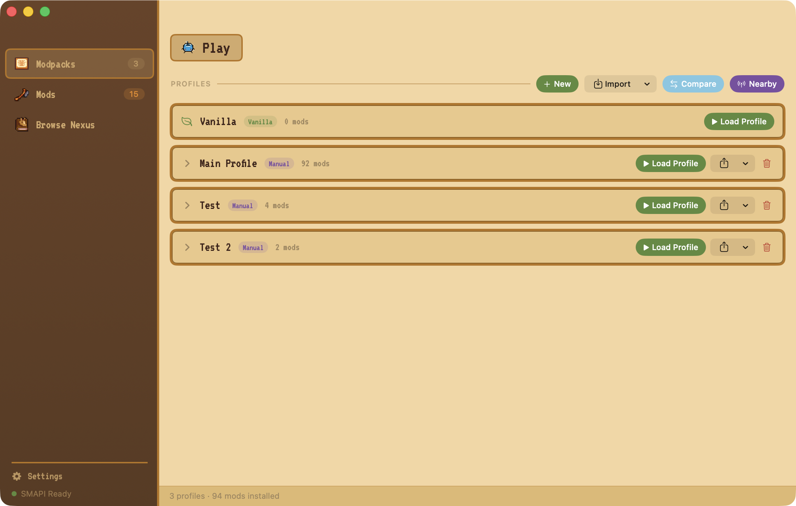
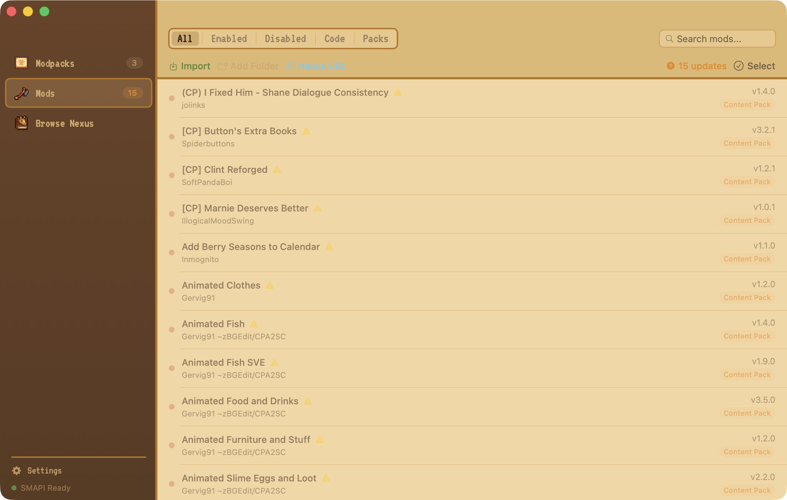
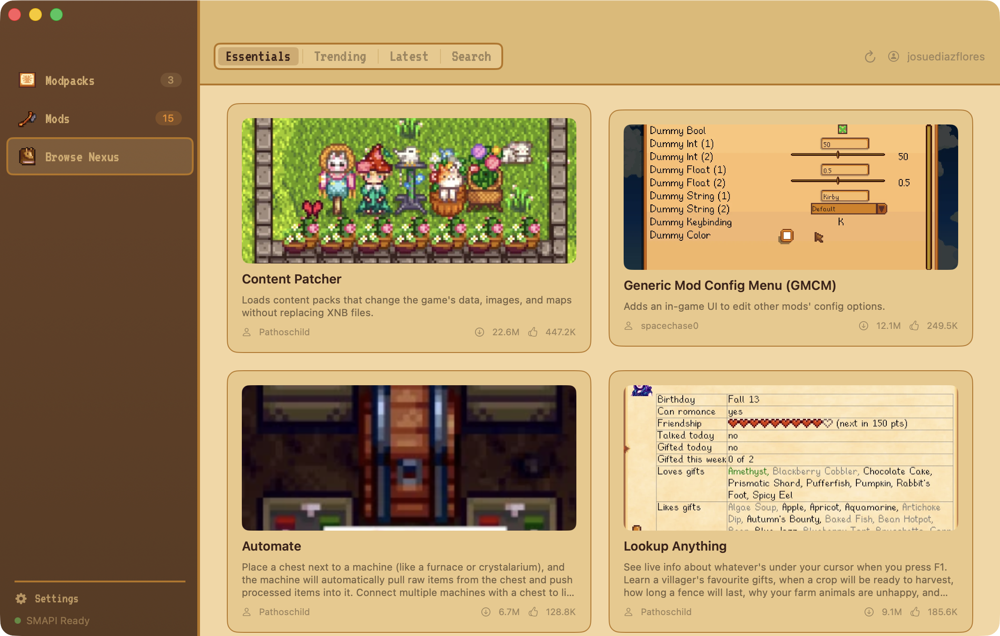

# Stardew Mod Manager

A native macOS mod manager for Stardew Valley with Nexus Mods integration, modpack profiles, and a Stardew-themed UI.

[](https://github.com/josuediazflores/StardewValleyMod/releases/latest/download/Stardew.Mod.Manager.zip)

> **Requires macOS 14+** and [SMAPI](https://smapi.io) installed.

---

## Install

1. Click the **Download for macOS** button above
2. Unzip `Stardew Mod Manager.zip`
3. If macOS says the app "is damaged and can't be opened," open Terminal and run:
   ```bash
   xattr -cr ~/Downloads/Stardew\ Mod\ Manager.app
   ```
   (Adjust the path if you unzipped it elsewhere.) This is normal for unsigned apps downloaded from the internet.
4. Drag `Stardew Mod Manager.app` to your Applications folder
5. Launch and enjoy — future updates install automatically from within the app

---

## Features

**Mod Management**
- Enable, disable, and delete mods with one click
- Bulk select to enable, disable, or delete multiple mods at once
- Undo accidental deletes within 6 seconds
- Drag & drop ZIP files or folders to import
- Active modpack stays in sync when you toggle mods

**Modpack Profiles**
- Save different mod configurations and switch instantly
- Export as `.smm` files or copy to clipboard to share with friends
- Compare profiles side-by-side

**Nexus Mods Integration**
- Browse trending, latest, and search mods with infinite scroll
- Essentials tab with curated must-have mods for new players
- Paste a Nexus URL to auto-download and install
- Click "Download with Manager" on Nexus (NXM protocol support)

**Quality of Life**
- Welcome guide walks you through setup on first launch
- Toast notifications confirm every action
- Sound effects for feedback (toggleable in Settings)
- Auto-updates from within the app
- Stardew and Pink theme options
- Auto-detects game path from Steam, Mac App Store, or GOG

---

## Screenshots

### Modpack Profiles


### Installed Mods


### Browse Nexus


---

## Building from Source

Requires Xcode Command Line Tools.

```bash
git clone https://github.com/josuediazflores/StardewValleyMod.git
cd StardewValleyMod
bash build-app.sh
open "build/Stardew Mod Manager.app"
```

---

## Scripts (Legacy)

The original shell/PowerShell scripts for one-command mod installation are still available:

<details>
<summary>macOS script</summary>

```bash
curl -sL "https://raw.githubusercontent.com/josuediazflores/StardewValleyMod/main/stardew-mods.sh" -o ~/stardew-mods.sh && chmod +x ~/stardew-mods.sh
bash ~/stardew-mods.sh setup
bash ~/stardew-mods.sh play
```
</details>

<details>
<summary>Windows script</summary>

```powershell
Invoke-WebRequest -Uri "https://raw.githubusercontent.com/josuediazflores/StardewValleyMod/main/stardew-mods.ps1" -OutFile "$HOME\stardew-mods.ps1"
powershell -ExecutionPolicy Bypass -File "$HOME\stardew-mods.ps1" setup
powershell -ExecutionPolicy Bypass -File "$HOME\stardew-mods.ps1" play
```
</details>

---

## License

Provided as-is. All mods belong to their respective authors — check individual mod pages on [NexusMods](https://www.nexusmods.com/stardewvalley) for licenses and credits.
